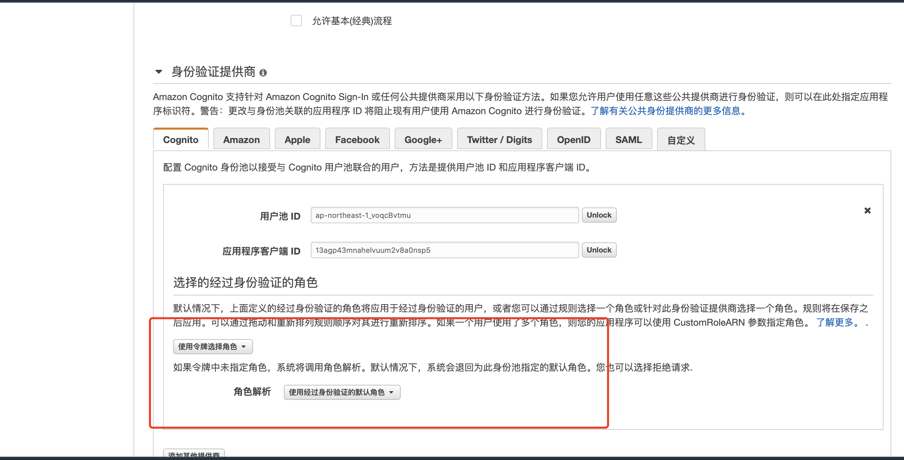

# 1、创建基础的后端运行环境
请使用ServerlessBackend.yaml通过CloudFormation创建后端运行环境

# 2、SSO 

## 2.1 创建用户池

请参考链接： https://auth.serverlessworkshops.io/user_auth/user_pool.html  

1.在 AWS 管理控制台中，选择服务，然后在安全性、身份和合规性下选择 Cognito。

2.选择"管理用户池"。

3.选择控制台右上角的"创建用户池"。

4.为用户池（例如 WilDryDes）提供一个名称。

5.选择”逐步介绍设置“以配置用户池选项。

6.保持 ”用户名“ 为选中状态，但另外选择 "还允许使用经验证的电子邮件地址进行登录" 和 "还允许使用经验证的电话号码进行登录".

7.保留所有其他项的默认值，一直点击下一步创建用户池。

## 2.2 配置HostUI用于实现单点登录

1、点击“应用程序集成-域名”，创建域名。

## 2.3 创建应用程序客户端

1、点击“常规设置-应用程序客户端”，点击“创建应用程序客户端“。例如：“wildrydes-web-app1 ”，去掉“生成客户端密钥”前面的复选框选中状态去，其他项保持默认值即可。

2、将分别将”应用程序客户端 ID“的值和”池 ID“复制出来放到一个txt文件中，后面将要用到。

## 2.4 为应用程序设置应用程序提供商和OAuth2.0

1、点击“应用程序集成-应用程序客户端设置”，参照如图进行配置，我们选择”Cognito User Pool“作为身份提供商。

2、请注意：”回调URL“和”注销URL“，需要与前端系统的端口保持一致，在本示例中，请保证端口的一致性。

3、打开 src/amplify-config.js 和存储【”应用程序客户端 ID“的值和”池 ID“】的文件进行配置，目前只配置标注项即可。

4、 "npm start" 启动应用程序，点击”Sign In“，将会跳转到HostUI托管的登录/注册页面，第一次需要先注册，注册成功登陆后访问http://localhost:3000/profile可以看到注册邮箱，表示用户登陆成功。

## 2.5 测试SSO效果

*[新应用程序接入]*
请拉取 tibcas-cognito-website-2 代码，重复 2.3 - 2.4 步骤，配置tibcas-cognito-website-2的src/amplify-config.js文件信息。

请注意：tibcas-cognito-website-2我们配置的端口为4000，所以“应用程序集成-应用程序客户端设置”中的”回调URL“和”注销URL“为：”http://localhost:4000“。

此时点击tibcas-cognito-website-2的”Sign In“不在需要登录,将会自动跳转到 Hosted UI 域名地址通过SSO登陆成功，然后访问 http://localhost:4000/profile 可以看到用户登陆信息。

# 3、权限验证

## 3.1 创建身份池
请使用【”应用程序客户端 ID“的值和”池 ID“】创建身份池，如图：

## 3.2 打开 src/amplify-config.js 配置 identityPoolId 和 API Gateway信息

## 3.3 配置身份池 - ”选择的经过身份验证的角色“

修改为使用令牌创建角色

## 3.4 创建用户组，为用户组对应的IAM Role 配置访问权限即可。
